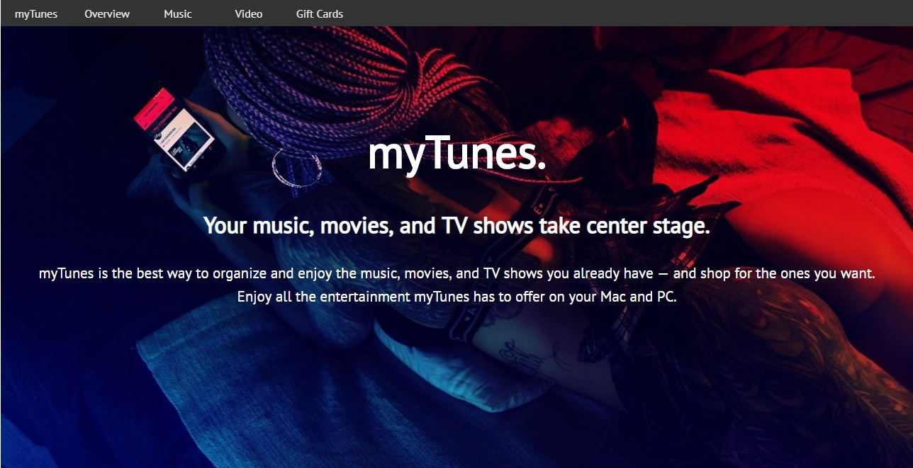

# Responsive Landing Page for "myTunes".
- Key points:
    - Images from: https://www.pexels.com/
    - Mocks from: https://smartmockups.com/
    - Icons from: https://fontawesome.com/start
    - Fav Icon generator: https://tools.dynamicdrive.com/favicon/
    - In the website:
        - CSS variables
        - Media Queries

## The Landing Page
visit at, [Click here.](https://thisis-shitanshu.github.io/landing-responsive-mytunes/)

